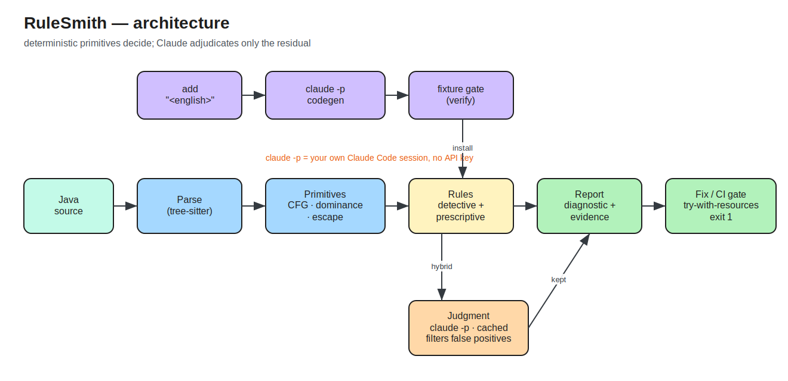

# RuleSmith

Turn plain-English coding rules into tested, AST-backed, deterministic checks —
runnable from one CLI. A neuro-symbolic linter: deterministic primitives (CFG,
dominance, escape analysis) compute the expensive-to-be-wrong facts; Claude
adjudicates only the fuzzy residual. Every finding cites its evidence and many
ship with a fix.

Design docs + the 184-rule catalog live in the agentathon vault notes.

## Status: demoable checkpoint (Phases 0–4 complete)

The full loop works end-to-end with **no API key** — codegen runs through the
Claude Code CLI (`claude -p`) using your own session.

```
# author a brand-new rule in English -> codegen -> fixtures gate -> install
rulesmith add "compare strings with .equals(), never with =="
  [ok] violation.java: 1   [ok] clean.java: 0   ...   installed (all green)

# lint real code -> rust-style diagnostic with deterministic evidence
rulesmith lint path/to/src
  warning[resource-leak]: `in` (InputStream) is never closed
    --> Foo.java:4:5
     = note: no close() call found and the resource does not escape the method
     = help: use try-with-resources: try (InputStream in = ...) { ... }

# auto-fix the safe subset
rulesmith lint --fix path/to/src
```

Proven on the real backend-connectors repo: **1242 files, 0 parse errors, 78
resource-leak findings**, including a confirmed `FileInputStream` leak in
`OneDriveConnectorService`.

## Decisions (locked)
- Name: RuleSmith
- Flagship rule: resource-leak
- Engine: raw tree-sitter (py bindings) — full AST needed for CFG
- Spec format: python DSL (a rule = a function returning findings)
- MVP language: Java
- LLM backend: **Claude Code CLI (`claude -p`, headless, no key)** — supported
  interface, uses the user's own authenticated session

## Architecture

Two rule families, six layers:
- **Detective** rules (find bugs) ride CFG + dominance + Claude judgment.
- **Prescriptive** rules (conventions) are AST match + codemod, no CFG.



Editable source: `diagram/ARCHITECTURE.excalidraw` (drag onto excalidraw.com);
regenerate both with `python diagram/build_arch.py`.

## Layout
```
rulesmith/
  parse.py       Phase 0  parse + AST find/query, spans, node text
  cfg.py         Phase 1  intraprocedural CFG + dominance / post-dominance
  dataflow.py    Phase 2  escape analysis + def-use helpers
  report.py      Phase 3  rust-style diagnostics (span + evidence + help + link)
  cli.py         Phase 3  lint / lint --fix / list / add ; dynamic rule discovery
  llm.py         Phase 4  Claude Code CLI backend (claude -p)
  authoring.py   Phase 4  NL rule -> codegen -> fixture gate -> install
rules/           installed rule modules (resource_leak, string_equality_check, ...)
fixtures/        pos/neg test cases per rule (the trust mechanism)
tests/           primitive + rule + autofix self-checks
```

## Phase log
- [x] **P0** tree-sitter Java parsing + AST query
- [x] **P1** CFG + dominance / post-dominance (self-check 3/3)
- [x] **P2** resource-leak rule end-to-end (5/5 fixtures; real bug found)
- [x] **P3** CLI + try-with-resources autofix (safe subset only)
- [x] **P4** authoring loop — English rule -> verified -> installed
- [x] **P5** judgment layer (filter false positives, cached) + optional-get rule
- [x] **P6** CI gate (`--rules` selector + GitHub Action template) + demo/NOTES.md
- [x] **P7** seed catalog rules via authoring loop (6 rules installed)
- [ ] stretch: curate full 184-catalog, per-rule doc pages, typestate, Scala 2.12

## Dev
```
python3 -m venv .venv && .venv/bin/pip install -r requirements.txt

# self-checks
.venv/bin/python -m rulesmith.cfg              # primitive dominance self-check
.venv/bin/python tests/test_resource_leak.py   # rule fixtures
.venv/bin/python tests/test_autofix.py         # autofix

# CLI
.venv/bin/python -m rulesmith.cli list
.venv/bin/python -m rulesmith.cli lint <path>                 # exit 1 on findings
.venv/bin/python -m rulesmith.cli lint --fix [--dry-run] <path>
.venv/bin/python -m rulesmith.cli lint --rules resource-leak,optional-get-without-ispresent <path>
.venv/bin/python -m rulesmith.cli lint --judge <path>          # filter false positives via claude -p
.venv/bin/python -m rulesmith.cli add "<rule in plain English>"
```

## Examples

`examples/java/PaymentGateway.java` — 10 flow-sensitive bugs a CLAUDE.md can't catch.
`examples/java-fixed/PaymentGateway.java` — same shapes, flow repaired (lints clean).
`examples/WALKTHROUGH.md` — the before/after, rule by rule.
`demo/NOTES.md` — demo-day script (why CLAUDE.md isn't enough).
`workflows/github-action.yml` — CI gate template for any Java repo.

## Known limits (honest)
- Resource detection is name-based (no type resolution) → false positives like
  `OffsetStorageReader`; Phase 5 judgment layer filters these.
- CFG exception edges are coarse (entry-level, not per-statement).
- Autofix only wraps the provably-safe subset; the rest is suggest-only.
- Autofix delegates formatting reflow to google-java-format.
